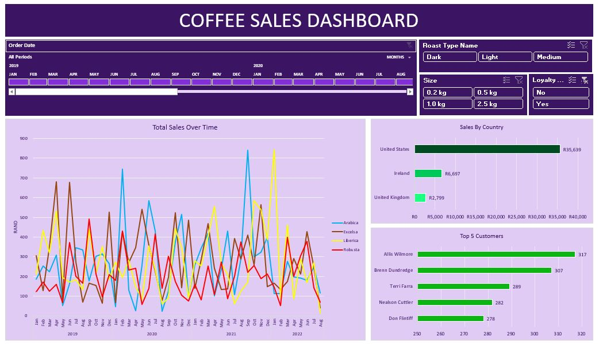

# Coffee Sales Analysis

An Excel-based coffee sales analysis project with a prepared dashboard for exploring sales performance, customer activity, product details and geographic results.

## Files

| File | Purpose |
| --- | --- |
| `coffeeOrdersData.xlsx` | Source data workbook containing the orders, customers and products tables. |
| `coffee_sales_dashboard.xlsx` | Enriched analysis workbook containing the prepared tables, summary sheets and dashboard. |

## Data

The source workbook contains three related tables:

- **orders**: 1,000 order records with order ID, date, customer ID, product ID, quantity, customer details, country, coffee type, roast type, size, unit price and sales/profit fields.
- **customers**: 1,000 customer records with customer ID, contact/location details and loyalty-card status.
- **products**: 48 product records with product ID, coffee type, roast type, package size, unit price, price per 100g and profit.

The dashboard workbook combines the order, customer, and product information so that sales can be analyzed by product attributes, customer, date and country.

## Dashboard Contents

The dashboard workbook includes:

- `Dashboard`: main dashboard view.
- `TotalSales`: sales summary by year, month and coffee type.
- `CountryBarChart`: sales totals by country.
- `Top5Customers`: the five customers with the highest sales.
- `orders`, `customers` and `products`: prepared analysis tables.

## How to Use

1. Open `coffee_sales_dashboard.xlsx` in Microsoft Excel.
2. Use the dashboard to review overall sales and compare performance across coffee types, countries, dates and customers.
3. Use the supporting sheets to inspect the records behind the dashboard summaries.
4. Keep `coffeeOrdersData.xlsx` as the source-data copy when making future updates.

## Notes

- The order date values are stored as Excel dates.
- Product size and price fields should be interpreted together when comparing products.
- If the source data changes, update the prepared tables and dashboard summaries in the dashboard workbook before reviewing the results.

## Screenshots

